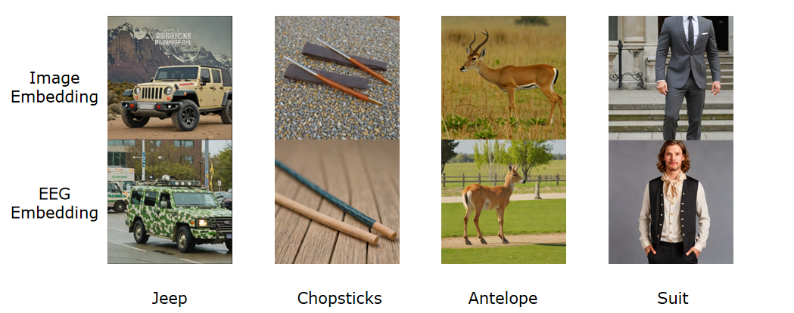

# EEG Image Decode Reproduction

This repository is a reproduction fork of
[ncclab-sustech/EEG_Image_decode](https://github.com/ncclab-sustech/EEG_Image_decode),
the official code release for **Visual Decoding and Reconstruction via EEG
Embeddings with Guided Diffusion**.

The goal of this fork is to run the original training and inference pipeline in
a local Windows/CUDA environment. No intentional methodological changes were
made to the model architecture, loss functions, or training objective.

## Repository Status

- Fork: [saitoshuka/EEG_Image_decode](https://github.com/saitoshuka/EEG_Image_decode)
- Upstream: [ncclab-sustech/EEG_Image_decode](https://github.com/ncclab-sustech/EEG_Image_decode)
- Paper: [arXiv:2403.07721](https://arxiv.org/abs/2403.07721)
- Original data/artifacts page: [Hugging Face dataset](https://huggingface.co/datasets/LidongYang/EEG_Image_decode)

The local git remotes are set up as:

```bash
origin    https://github.com/saitoshuka/EEG_Image_decode.git
upstream  https://github.com/ncclab-sustech/EEG_Image_decode.git
```

## Scope of This Reproduction

This is a functional reproduction of the original codebase rather than an exact
environment-level reproduction. The main work in this fork is environment and
execution adaptation:

- replaced the original absolute Linux data paths with paths matching the local
  reproduction layout;
- made dataset config loading stable when scripts are launched from different
  working directories;
- fixed local feature/latent lookup paths;
- adjusted some command-line flags and Weights & Biases logging guards;
- fixed encoder construction for Braindecode encoder baselines;
- restored the root `models/` package required by the retrieval and generation
  scripts;
- kept large data files, checkpoints, W&B logs, and generated outputs outside
  git tracking.

## Reconstruction Example

The figure below compares reconstructions conditioned on image embeddings and
EEG embeddings for four representative test classes.



## Data and External Artifacts

The GitHub repository contains code only. Large data and feature artifacts are
stored outside git.

The authors provide part of the experiment artifacts on Hugging Face under
`LidongYang/EEG_Image_decode` with an Apache-2.0 dataset card. The public files
checked for this reproduction include:

- `Preprocessed_data_250Hz/`: preprocessed EEG data for subjects 01-10;
- `preprocessed_MEG/`: preprocessed MEG data for subjects 01-04;
- `emb_eeg/`: EEG embedding files;
- `fintune_ckpts/sub-xx/diffusion_prior.pt`: diffusion prior checkpoints;
- `generated_imgs.tar.gz`: generated image archive;
- `ViT-H-14_features_train.pt` and `ViT-H-14_features_test.pt`;
- `train_image_latent_512.pt` and `test_image_latent_512.pt`.

The current local layout expects the downloaded data to sit one directory above
this repository:

```text
Image Reconstruction/
  EEG_Image_decode/
  Preprocessed_data_250Hz/
  images_set/
  emb_eeg/
  fintune_ckpts/
  preprocessed_MEG/
  train_image_latent_512.pt
  test_image_latent_512.pt
  ViT-H-14_features_train.pt
  ViT-H-14_features_test.pt
```

`Generation/data_config.json` and `Retrieval/data_config.json` use relative paths
for this layout. If your data is elsewhere, update those two config files.

Example Hugging Face download command:

```bash
huggingface-cli download LidongYang/EEG_Image_decode \
  --repo-type dataset \
  --local-dir .. \
  --include "Preprocessed_data_250Hz/**" "emb_eeg/**" "fintune_ckpts/**" \
            "ViT-H-14_features_*.pt" "*image_latent_512.pt"
```

The `images_set/` directory is also required by the retrieval and reconstruction
scripts. If it is missing, download it from the original data sources described
by the upstream repository.

## Local Environment

The reproduction was run in a different environment from the original authors'
environment, so small numerical or performance differences may occur.

- OS: Windows 11, build `10.0.26200`
- Conda executable recorded by local W&B runs:
  `C:\Users\xinji\.conda\envs\image\python.exe`
- Python: `3.12.12`
- GPU: NVIDIA GeForce RTX 5070 Ti, 16 GB
- NVIDIA driver: `577.00`
- System CUDA reported by `nvidia-smi`: `12.9`
- PyTorch: `2.10.0+cu128`
- PyTorch CUDA runtime: `12.8`
- W&B: `0.25.0`
- Transformers: `4.36.0`
- Diffusers: `0.30.0`
- Braindecode: `0.8.1`
- MNE: `1.9.0`

There is also a local conda environment named `bci`. As checked on 2026-05-07,
that environment has Python `3.10.19` and PyTorch `2.10.0+cu128`, and it can see
the RTX 5070 Ti. However, it currently does not include several packages required
by the full pipeline, including `wandb`, `open-clip-torch`, `braindecode`, `mne`,
`diffusers`, and `transformers`.

The original environment files in this repository are useful references. To run
from `bci`, install the missing dependencies first or recreate the environment
from `environment.yml` / `requirements.txt`.

## Reproduction Runs

Weights and experiment logs from this reproduction are tracked through Weights &
Biases rather than committed to git.

Main local W&B runs found in this workspace:

- Retrieval baseline:
  [`eeg_retrieval_contrast/eegnetv4_bs256_e30`](https://wandb.ai/xinjiaoyang-university-of-tokyo/eeg_retrieval_contrast/runs/j8v1hxx2)
- Retrieval in-subject:
  [`eeg_retrieval_insubject/insubject_all_subjects`](https://wandb.ai/xinjiaoyang-university-of-tokyo/eeg_retrieval_insubject?nw=nwuserxinjiaoyang)
- Subject-08 reconstruction:
  [`eeg_recon_insubject/sub08_recon`](https://wandb.ai/xinjiaoyang-university-of-tokyo/eeg_recon_insubject/runs/waqhfvl2)

Example retrieval command:

```bash
conda activate image
cd Retrieval
python contrast_retrieval.py \
  --encoder_type EEGNetv4_Encoder \
  --epochs 30 \
  --batch_size 256 \
  --data_path "../../Preprocessed_data_250Hz" \
  --entity xinjiaoyang-university-of-tokyo \
  --project eeg_retrieval_contrast \
  --name eegnetv4_bs256_e30 \
  --device cuda:0
```

Example reconstruction command:

```bash
conda activate image
cd Generation
python ATMS_reconstruction.py \
  --data_path "../../Preprocessed_data_250Hz" \
  --insubject True \
  --subjects sub-08 \
  --logger True \
  --gpu cuda:0 \
  --output_dir ./outputs/contrast \
  --entity xinjiaoyang-university-of-tokyo \
  --project eeg_recon_insubject \
  --name sub08_recon
```

## Verification

Current checks performed for this fork:

- local remotes point to the fork as `origin` and the official repository as
  `upstream`;
- Hugging Face artifact listing was checked on 2026-05-07;
- configured local data paths resolve to existing directories/files in this
  workspace;
- `models.loss`, `models.util`, and the transformer subject-layer imports work
  in the `image` conda environment;
- modified Python files pass `py_compile`.

## Notes

This reproduction should be cited as a reproduction of the original paper and
repository. The original code is MIT licensed. The Hugging Face data/artifacts
page declares Apache-2.0; additional raw EEG/MEG/image sources may have their
own terms.

## Citation

```bibtex
@inproceedings{li2024visual,
 author = {Li, Dongyang and Wei, Chen and Li, Shiying and Zou, Jiachen and Liu, Quanying},
 booktitle = {Advances in Neural Information Processing Systems},
 pages = {102822--102864},
 publisher = {Curran Associates, Inc.},
 title = {Visual Decoding and Reconstruction via EEG Embeddings with Guided Diffusion},
 url = {https://proceedings.neurips.cc/paper_files/paper/2024/file/ba5f1233efa77787ff9ec015877dbd1f-Paper-Conference.pdf},
 volume = {37},
 year = {2024}
}
```
